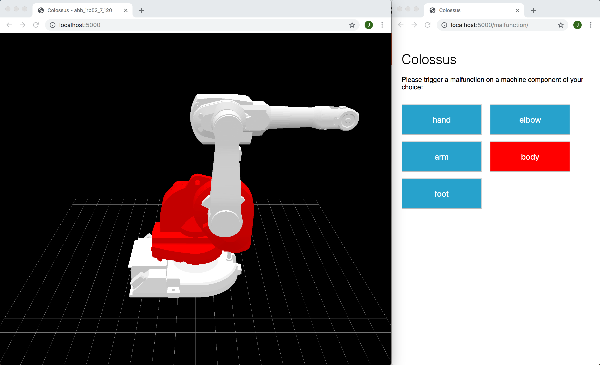

Colossus
========

This is a proof-of-concept (PoC) to demonstrate that visualization of a
machine with WebGL and SignalR is possible.


Build and run
-------------

On a command line:

```
dotnet run
```

or if you want to expose on the network:

```
dotnet run --urls http://0.0.0.0.0:5000
```

Point your browser to http://localhost:5000 to see the machine rendered
in 3D. To control the machine browse to http://localhost:5000/malfunction/.

You should see something like this:

[](wwwroot/images/screenshot.png)

Note that the two browsers could be on different machines due to the real-time
communication of SignalR.


Technical
---------

- Builds on *.NET Core 2.2*
- Loads models in [COLLADA](https://en.wikipedia.org/wiki/COLLADA)-format
- The 3D rendering is done with the superb [three.js](https://threejs.org)-library and WebGL
- Real-time communication uses [SignalR](https://dotnet.microsoft.com/apps/aspnet/real-time)


Author: joriszwart.nl  
License: Apache-2.0 license (threejs is MIT, but the robot model and SignalR have Apache-2.0 licenses)  
Date: Jul 18 14:04:16 2019  
Category: Visualizing  
Tags: 3D, HTML5, Proof of Concept, SignalR, three.js, Visualizing, WebGL  
